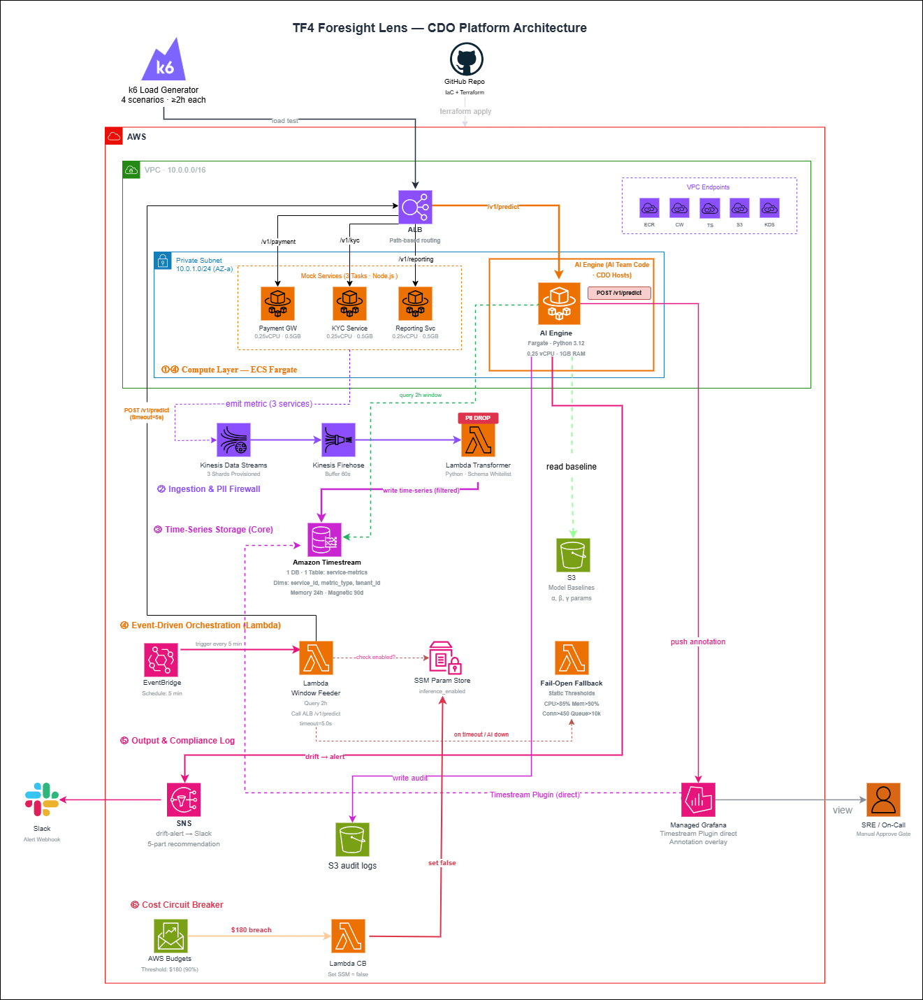

# Infrastructure Design - Task Force 4 · CDO-07

<!-- Doc owner: Nhóm CDO7
     Status: Draft (W11 T3-T4) → Final (W11 T6 Pack #1) → Updated (W12 T4 Pack #2)
     Word target: 1500-2500 từ -->

## 1. Architecture diagram



*Caption: Foresight Lens predictive monitoring system với telemetry pipeline (mock services → Kinesis → Timestream), AI inference engine (ECS Fargate), và dashboard integration (Grafana annotations). Load balancer routes prediction requests, circuit breaker prevents budget overrun.*

## 2. Component table

| Component | AWS Service | Reason | Cost note |
|---|---|---|---|
| **Compute** | ECS Fargate | AI inference engine 24/7 uptime, eliminates Lambda cold start với ML libraries | $11.25 |
| **API entry** | Application Load Balancer | Routes `/v1/predict` requests, health checks, target group management | $18.43 |
| **Database** | Amazon Timestream | Time-series optimized, auto-tiered storage (7d Memory + 90d Magnetic), SQL queries | $28.50 |
| **Storage** | S3 Standard | ML model baselines per-service, configuration files, lifecycle policies | $1.65 |
| **Event bus** | Kinesis Data Streams | 3 shards partitioned by service_id, 24h replay capability, multi-tenant isolation | $32.85 |
| **Observability** | Amazon Managed Grafana | Direct Timestream integration, annotations overlay, workspace management | $9.00 |
| **Load Generation** | ECS Fargate (3 tasks) | Mock payment/kyc/reporting services, Node.js async I/O simulation | $22.83 |
| **Stream Delivery** | Kinesis Data Firehose | Format transformation to Timestream, delivery buffer configuration | $4.35 |
| **Audit Storage** | S3 Standard + KMS | Prediction audit logs JSON format, encrypted at-rest, lifecycle to IA after 30d | $0.50 |
| **Functions** | Lambda + EventBridge | window-feeder (5min trigger), pii-filter (per-event), cost circuit breaker | $0.85 |
| **Networking** | VPC Endpoints | ECR, CloudWatch, Timestream, S3, Kinesis - private connectivity | $41.50 |
| **Logging** | CloudWatch Logs | Centralized logging all services, 7-day retention | $8.11 |
| **Cost Control** | AWS Budgets | $180 threshold alert, Lambda circuit breaker trigger | $0.10 |
| **Total** | | | **$179.92** |

## 3. Differentiation angle deep-dive

### 3.1 Why this angle?

**Serverless-first + Managed TSDB**: Chọn architecture pattern này để optimize cho capstone constraints - zero ops overhead, predictable costs, và rapid deployment timeline. Alternative patterns (self-managed clusters, traditional monitoring stack) require significant operational investment không phù hợp với 3-tuần implementation window.

Key architectural decisions:
- Managed services over self-hosted (Timestream vs Prometheus cluster)  
- Always-on ECS Fargate over Lambda (eliminate ML cold start issues)
- Stream-native processing (Kinesis) over batch ETL patterns
- Single TSDB table over per-service databases (operational simplicity)

### 3.2 Vượt trội ở đâu (số liệu)

| Axis | Serverless+TSDB approach | Self-managed cluster estimate |
|---|---|---|
| Cost / month | $179.92 (89.96% budget utilization) | $200+ (EC2 + EBS + ops tools) |
| Deployment time | <4h (Terraform + container deploy) | 2-3 days (cluster setup + config) |
| Ops overhead (hr/week) | 0 (fully managed services) | 8-12 (patching, monitoring, scaling) |
| Time to scale | Auto (managed service scaling) | Manual (cluster resize + rebalancing) |

### 3.3 Weakness chấp nhận

- **Vendor lock-in**: Heavy dependency on AWS managed services (Timestream, Kinesis, Fargate). Trade-off acceptable cho capstone timeline vs production portability.
- **Single region**: No cross-region redundancy to minimize data transfer costs. Recovery strategy documented in ADR but not implemented.
- **Managed service limits**: Constrained by AWS service quotas (Kinesis shard limits, Timestream ingestion rates) vs self-managed scalability.

## 4. Multi-tenant approach

### 4.1 Tenant model

- **Tenant ID format**: `service_id` (payment-gateway, kyc-service, reporting-api)
- **Header**: `service_id`, `tenant_id`, `metric_type` mandatory trong Kinesis payload
- **Subscription tiers**: All 3 services Tier-1 (per-service baseline models, 5-min prediction intervals)

### 4.2 Isolation pattern

- **Data isolation**: Pool model - single Timestream table `service-metrics` với dimension-level separation qua WHERE filters
- **Compute isolation**: Shared ECS Fargate AI Engine với request-level routing theo payload service_id
- **Why this pattern**: Balance cost efficiency vs isolation strength. Single table → simple Grafana config, shared compute → $60-80/tháng savings vs per-tenant containers

### 4.3 Tenant onboarding flow

```
1. Register service_id → k6 allowlist + mock engine configuration
2. AI team train baseline từ historical data → upload s3://baselines/{service_id}/
3. EventBridge scheduler setup cho service (5-min prediction intervals) 
4. Clone Grafana dashboard template → configure service_id variable filter
5. Smoke test: verify metrics flow + prediction calls → tenant ready
   Total: <30 phút end-to-end
```

### 4.4 Noisy neighbor mitigation

- **Per-tenant quota**: Kinesis partition key = `service_id` → automatic shard routing, throughput isolation
- **Kinesis shard limits**: Each shard 1MB/sec or 1000 records/sec capacity per partition
- **Resource reservation**: AI Engine có thể add per-service rate limits (future enhancement)
- **Audit isolation**: S3 audit logs partitioned by date path `s3://audit-logs/{year}/{month}/{day}/` với prediction_id filename

## 5. Alternatives considered

### 5.1 Compute layer

- **Option A**: Lambda + API Gateway - Pros: cost per invoke, auto-scaling · Cons: cold start 5-10s với ML libraries, 15min limit
- **Option B**: EKS + Kubernetes - Pros: container orchestration, flexibility · Cons: cluster management overhead, higher cost
- ✅ **Chosen**: ECS Fargate + ALB - Reason: Eliminates cold start performance issues, predictable latency <200ms, no cluster management

### 5.2 Database

- **Option A**: Self-managed Prometheus trên EC2 - Pros: PromQL familiar, open source · Cons: ops overhead, ~$90/month EC2 costs
- **Option B**: InfluxDB Cloud - Pros: time-series optimized · Cons: vendor lock-in, data transfer costs
- ✅ **Chosen**: Amazon Timestream - Reason: Zero-ops managed service, auto-tiered storage (7d + 90d), SQL queries, $28.50/month

### 5.3 Event streaming

- **Option A**: SQS Standard - Pros: simple setup, low cost · Cons: no partitioning, no replay capability
- **Option B**: Apache Kafka trên MSK - Pros: high throughput, mature ecosystem · Cons: cluster management, higher cost
- ✅ **Chosen**: Kinesis Data Streams - Reason: Service_id partitioning critical cho multi-tenant isolation, 24h replay cho testing

## 6. Scaling strategy

- **Vertical**: ECS auto-scaling CPU >70% for 2 minutes → launch additional task
- **Horizontal**: Kinesis On-Demand mode auto add/remove shards theo traffic spikes
- **Triggers**: CloudWatch alarms - ECS CPU utilization, Kinesis incoming records, Lambda error rates

## 7. Failure modes + recovery

| Failure | Detection | Recovery | RTO | RPO |
|---|---|---|---|---|
| AI Engine crash | ALB health check fail 3x | ECS auto-restart new task | <30s | 0 |
| AI timeout >5.0s | Request timeout exception | Fail-open to static thresholds | <1s | 0 |
| Timestream outage | Firehose delivery errors | Kinesis 24h buffer retention | Auto | 0 |
| Budget exceed $180 | AWS Budgets alert | Lambda circuit breaker via SSM | <5s | 0 |
| VPC endpoint failure | Connection timeout | Multi-endpoint redundancy | <30s | 0 |

## Related documents

- [`01_requirements_analysis.md`](01_requirements_analysis.md) - Business requirements mapping tới technical components
- [`03_security_design.md`](03_security_design.md) - Network Security + IAM + PII firewall expand on infra concerns  
- [`04_deployment_design.md`](04_deployment_design.md) - IaC Terraform + CI/CD GitOps cho infra này
- [`05_cost_analysis.md`](05_cost_analysis.md) - Per-service cost model $179.92/tháng breakdown chi tiết + optimization strategies
- [`08_adrs.md`](08_adrs.md) - Infra architecture decisions (ADR-001 to ADR-004)