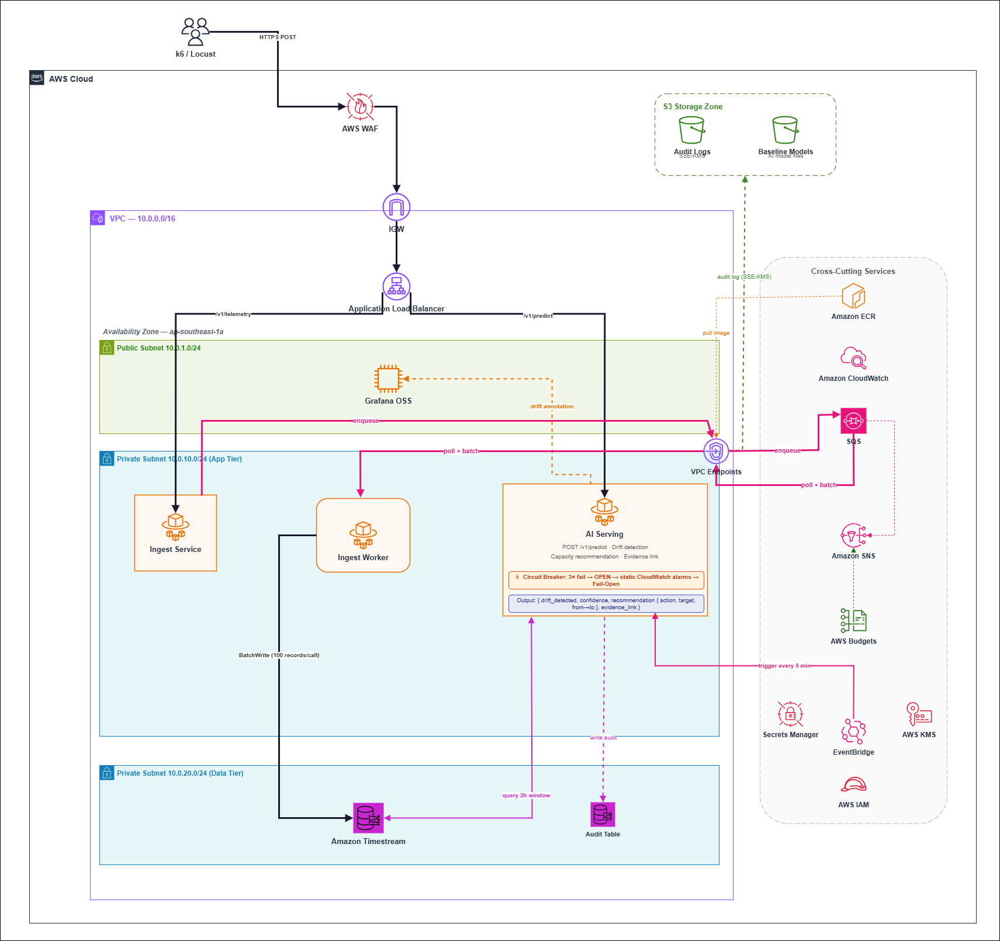

# Infrastructure Design - Task Force 4 · CDO-07

<!-- Doc owner: CDO-07
     Status: Draft (W11 T3-T4) → Final (W11 T6 Pack #1) → Updated (W12 T4 Pack #2)
     Word target: 1500-2500 từ -->

## 1. Architecture diagram



*Caption: 3-tier architecture — single AZ ap-southeast-1a. Traffic từ k6/Locust qua WAF → IGW → ALB, chia route theo path: `/v1/telemetry` vào Ingest Service (validate + enqueue SQS, trả về <10ms), `/v1/predict` vào AI Serving. SQS buffer → Ingest Worker poll + BatchWrite Timestream. EventBridge trigger AI Serving mỗi 5 phút để query Timestream 2h window, detect drift, output recommendation. Khi drift detected: push annotation lên Grafana + write audit S3. Circuit Breaker fail-open đảm bảo khi AI down vẫn có static CloudWatch alarm — không blind 24/7. ECR cung cấp container images qua VPC Endpoints. Tất cả Fargate traffic đến AWS services qua VPC Endpoints, không qua internet.*

## 2. Component table

| Component | AWS Service | Reason | Cost note |
|---|---|---|---|
| API entry | Application Load Balancer + AWS WAF | ALB path-based routing `/v1/telemetry` và `/v1/predict` đến 2 Fargate khác nhau. WAF inspect payload layer 7: rate-limit 10k req/5min, PII regex reject, schema whitelist — bảo vệ trước khi vào VPC. | ALB ~$22.50/mo · WAF ~$5/mo |
| Event bus | Amazon SQS Standard + DLQ | Decouple Ingest speed khỏi Timestream write speed. Khi Timestream throttle hoặc down, SQS giữ message 4 ngày — zero data loss. DLQ bắt message sau 3 fail → CloudWatch alarm → manual replay. Worker delete message CHỈ sau khi write thành công (at-least-once delivery). | ~$2.48/mo (6.2M msg) |
| Compute | ECS Fargate — 3 tasks: Ingest Service, Ingest Worker, AI Serving | Single Responsibility mỗi task: Ingest chỉ enqueue (<10ms); Worker chỉ poll + BatchWrite (scale theo SQS depth); AI Serving chỉ inference (circuit breaker riêng). Scale axis hoàn toàn độc lập. Không manage server. | ~$28/mo (3 tasks × 730h) |
| Database | Amazon Timestream | Purpose-built TSDB: Memory Store 7d (<50ms query cho AI 2h window), Magnetic 90d (retention requirement TF4). Native SQL time functions: `ago(2h)`, `BIN(time,1m)`. Serverless — pay per write + query, không pay khi idle. | ~$4.80/mo demo scale |
| Storage | Amazon S3 (SSE-KMS) | Audit log mỗi prediction (≥6 fields, encrypted at rest — TF4 hard requirement) + baseline model files cho AI Serving load khi start. Lifecycle → Glacier sau 90d. | ~$0.50/mo |
| AI serving trigger | Amazon EventBridge | Schedule `rate(5 minutes)` fan-out 3 target song song (svc-a, svc-b, svc-c). Decoupled khỏi AI code — thay interval không cần redeploy. Observable qua CloudWatch. | ~$0.01/mo |
| Observability | Grafana OSS (EC2 t3.micro) + CloudWatch | Grafana: per-service dashboard với drift annotation overlay (TF4 requirement "embed Grafana"). CloudWatch: custom metrics (prediction_latency, circuit_breaker_active, SQS depth) + alarms → SNS. Fail-open: khi AI down → static threshold alarms activate. | EC2 ~$7.59/mo · CW ~$3/mo |
| Registry | Amazon ECR | 3 Docker images: ingest-service, ingest-worker, ai-serving. Pull qua VPC Endpoint — không ra internet. Lifecycle policy tự clean old images. | ~$0.60/mo |
| Security | AWS KMS (CMK) + IAM Task Roles + Secrets Manager | CMK encrypt SQS + S3 + Timestream. IAM least privilege: mỗi Fargate task chỉ có đúng permission cần (ingest-service-role chỉ `sqs:SendMessage`). Secrets Manager: Grafana API key, không hardcode. | ~$1.10/mo KMS |
| Cost guard | AWS Budgets | Alert 80% ($160) và 100% ($200) → SNS → scale down. TF4 hard requirement: cost circuit breaker demo được. | free tier |

## 3. Differentiation angle deep-dive

### 3.1 Why this angle?

Angle: **"Single Responsibility Infrastructure"** — mỗi Fargate task có đúng một lý do để tồn tại, một lý do để fail, một lý do để scale. Đây là áp dụng nguyên tắc SOLID vào infrastructure layer.

Hầu hết CDO team xây 2 service (Ingest + AI) để đơn giản hơn. Nhóm chọn 3 service vì SQS là thành phần bắt buộc để đảm bảo zero data loss — nếu đã có SQS thì phải có Worker riêng để poll. Worker scale theo queue depth, Ingest scale theo HTTP connections — hai axis này không thể gộp vào một service mà không tạo ra over-provisioning.

Fintech context của TF4 (miss SLO 7 lần do capacity exhaustion silent) đòi hỏi platform phải **không bao giờ mất data** ngay cả khi downstream down. SQS 4-day buffer + at-least-once delivery là câu trả lời cho requirement đó.

### 3.2 Vượt trội ở đâu (số liệu)

| Axis | My number (Option A — SQS) | Competing angle (Option X — Kinesis) |
|---|---|---|
| Cost / month demo scale | **~$93/mo** (57% dưới budget) | ~$130+/mo (Kinesis min $29 + Timestream TCU risk) |
| Ingest HTTP P99 latency | **<10ms** (chỉ enqueue SQS) | ~50ms (Kinesis put record + ack) |
| Data loss risk khi Timestream down | **Zero** (SQS 4-day retention) | Zero (Kinesis 7-day) |
| Build time W12 (6 ngày) | **Thấp** (SQS + Fargate quen thuộc) | Cao hơn (Kinesis shard config + Lambda consumer checkpoint) |
| Ops overhead | **Thấp** (fully managed SQS) | Trung bình (Kinesis shard management) |
| Throughput ceiling demo | Đủ (SQS unlimited TPS) | Cao hơn (Kinesis sharding cho 50k/s production) |

### 3.3 Weakness chấp nhận

- **Single AZ:** Chọn 1 AZ để giảm cost và complexity trong 6 ngày build. TF4 yêu cầu 99.5% demo-quality — single AZ + ECS auto-restart (<30s) đủ đáp ứng. Multi-AZ DR design-only trong ADR-009.
- **SQS Standard (not FIFO):** Time-series metrics không cần strict ordering vì timestamp có trong payload. Nếu cần ordering strict (ví dụ financial event log), migrate sang FIFO — documented trong ADR-010.
- **Timestream TCU cost risk:** Ở production scale với query không giới hạn, Timestream TCU có thể spike. Mitigated bằng query pattern controlled (chỉ AI Serving query, 2h window, 3 services × 5min) và AWS Budgets alert.
- **Grafana single EC2:** t3.micro single point of failure. Acceptable vì Grafana là observability tool, không phải data plane — crash Grafana không mất data, ECS auto-recover sau <5 phút.

## 4. Multi-tenant approach

### 4.1 Tenant model

- **Tenant ID format:** `service_id` string — `svc-a`, `svc-b`, `svc-c` (3 fintech service profiles)
- **Header:** `service_id` mandatory trong mọi telemetry payload
- **Subscription tiers:** 3 tier-1 services (payment gateway, order processor, API gateway) — mỗi service có per-service baseline riêng

### 4.2 Isolation pattern

- **Data isolation:** Pool model — shared Timestream database, partition bằng dimension `service_id` + `tenant_id`. Query luôn có WHERE `service_id = ?` — không bao giờ cross-read.
- **Compute isolation:** Shared Fargate tasks — isolation ở application layer (validate tenant, filter by service_id). Không cần per-tenant container vì đây là monitoring platform, không phải data processing per-tenant.
- **Why this pattern:** Silo model (mỗi tenant có Timestream riêng) tốn ~3× cost và không cần thiết cho 3 services capstone. Pool model với dimension partitioning đủ isolation và rẻ hơn.

### 4.3 Tenant onboarding flow

```
1. Thêm service_id mới vào allowlist trong Ingest Service env var
2. Upload baseline model file: s3://foresight-baseline-models/{service_id}/baseline-v1.0.pkl
3. Tạo EventBridge target mới: POST /v1/predict {"service_id": "svc-new"}
4. Tạo Grafana dashboard cho service mới (clone từ template)
5. Chạy k6 warm-up script 24h để build initial metric history
6. Trigger manual baseline train: POST /admin/baseline/train {"service_id": "svc-new"}
7. Smoke test: verify drift annotation xuất hiện trên Grafana sau trigger test
```

### 4.4 Noisy neighbor mitigation

- **Per-tenant quota:** WAF rate-limit 10,000 req/5min per IP — không một service nào flood pipeline
- **SQS visibility timeout:** 60s — một message của svc-a không block processing svc-b
- **Timestream dimension filter:** Query luôn WHERE `service_id = ?` — không scan toàn bộ table
- **AI Serving isolation:** Mỗi EventBridge invocation là independent HTTP call per service_id — svc-a slow không block svc-b prediction

## 5. Alternatives considered

### 5.1 Event bus / Ingestion layer

- **Option A (Kinesis Data Stream):** API Gateway + Kinesis sharded theo `service_id`, Lambda consumer + Fargate backup. Pros: throughput 50k events/s, strict ordering per shard, 7-day replay. Cons: minimum ~$29/mo dù idle (on-demand shard), Lambda consumer cần checkpoint mechanism phức tạp, API Gateway thêm integration latency cho ingest critical path, Fargate backup "tùy chọn" tạo ambiguity trong design. Cost risk nếu scale: nhiều shard → expensive.
- ✅ **Option B (SQS Standard) — Chosen:** SQS $0.40/million messages (~$2.48/mo demo scale), DLQ built-in, unlimited TPS, at-least-once delivery tự nhiên (delete after write), không cần checkpoint logic. Worker scale theo `SQS.ApproximateNumberOfMessages` — clean single metric. Phù hợp với 6-ngày build timeline.

### 5.2 Compute layer

- **Option A (2 Fargate — Ingest + AI, write trực tiếp):** Đơn giản hơn. Cons: Ingest HTTP thread block khi Timestream throttle → latency tăng → k6 timeout. In-memory buffer mất data nếu task crash. Không scale Worker độc lập.
- **Option B (Lambda consumer thay Worker):** Lambda nhẹ hơn. Cons: cold start 200-500ms sau idle period, max 15-min runtime không phù hợp long-polling loop, state management phức tạp hơn giữa các invocation.
- ✅ **Option C (3 Fargate — Ingest / Worker / AI) — Chosen:** Single Responsibility mỗi task. Worker long-running không bị timeout. Scale Worker theo SQS depth độc lập. Zero data loss qua SQS buffer. Predictable latency (warm container).

### 5.3 Database / Storage

- **Option A (Prometheus on EC2):** Grafana-native, PromQL quen thuộc. Cons: pull model — cần Pushgateway cho push-based pipeline (anti-pattern theo Prometheus docs). EC2 t3.micro $7.59/mo fixed dù idle, 1GB RAM tight cho 90d retention. PromQL learning curve cho AI team. **Thực tế đắt hơn Timestream ở demo scale** (~$9-10/mo vs ~$4-5/mo).
- **Option B (Raw S3 + Athena):** Chi phí thấp nhất. Cons: Athena query 2-30s — không đáp ứng P99 <200ms requirement cho AI Serving 2h window query.
- ✅ **Option C (Amazon Timestream) — Chosen:** Purpose-built TSDB, Memory Store <50ms query, native SQL (`ago(2h)`, `BIN(time,1m)`), serverless pay-per-use (~$4-5/mo demo scale), auto-tier memory→magnetic, VPC Endpoint + IAM + CloudWatch native AWS integration.

## 6. Scaling strategy

- **Fargate Ingest Service:** Horizontal — target CPU 70%. Min 2 tasks (HA), max 8. Scale out khi k6 burst tăng HTTP connections.
- **Fargate Ingest Worker:** Horizontal — trigger theo `SQS.ApproximateNumberOfMessages > 100,000`. Min 2, max 8. Scale axis hoàn toàn độc lập với Ingest — queue depth tăng → thêm Worker, không cần thêm Ingest.
- **Fargate AI Serving:** Horizontal — target CPU 60%. Min 1, max 2. EventBridge trigger fixed 5 phút, scale thêm khi nhiều services onboard.
- **Timestream:** Serverless — tự scale write/query throughput, không cần config.
- **SQS:** Managed — unlimited TPS tự động, không cần config shard.

## 7. Failure modes + recovery

| Failure | Detection | Recovery | RTO | RPO |
|---|---|---|---|---|
| Fargate Ingest crash | ALB health check `GET /health` fail 3× | ECS auto-restart task | <30s | 0 (SQS giữ message) |
| Fargate Worker crash | ECS health check | Auto-restart; SQS message ở lại queue (visibility timeout expire → retry) | <30s | 0 |
| Fargate AI Serving crash | CloudWatch `prediction_count < 1` trong 10 phút | Auto-restart; Circuit Breaker OPEN → static alarms activate | <30s | N/A (degraded, not blind) |
| SQS message fail ×3 | DLQ message count > 0 → CloudWatch alarm | SNS alert → manual replay script sau khi Timestream recover | Manual | 0 (DLQ giữ) |
| Timestream throttle (429) | Worker catch exception | Exponential backoff, message ở lại SQS tự retry | N/A | 0 |
| Timestream outage | Worker catch exception | Messages tích lũy SQS (4-day buffer); Worker retry khi recover | Tự recover | 0 |
| AI Serving predict fail ×3 | Circuit Breaker counter | OPEN → static CloudWatch alarms (CPU >85%, queue >5k, latency >500ms) activate | <10s | N/A |
| Grafana crash | CloudWatch EC2 alarm | EC2 auto-recover; historical data safe trong Timestream | <5min | 0 |
| Budget exceeded $200 | AWS Budgets 100% alert | SNS → email → manual scale down Fargate tasks | Manual | N/A |
| AZ outage | CloudWatch alarm | Manual failover (design-only — single AZ capstone, DR in ADR-009) | TBD | TBD |

## Related documents

- [`03_security_design.md`](03_security_design.md) - Network Security §4 + IAM §5 + Data Security §6 expand on infra concerns
- [`04_deployment_design.md`](04_deployment_design.md) - IaC + CI/CD + GitOps cho infra này
- [`05_cost_analysis.md`](05_cost_analysis.md) - Per-tenant cost model based on this infra
- [`08_adrs.md`](08_adrs.md) - Infra architecture decisions
