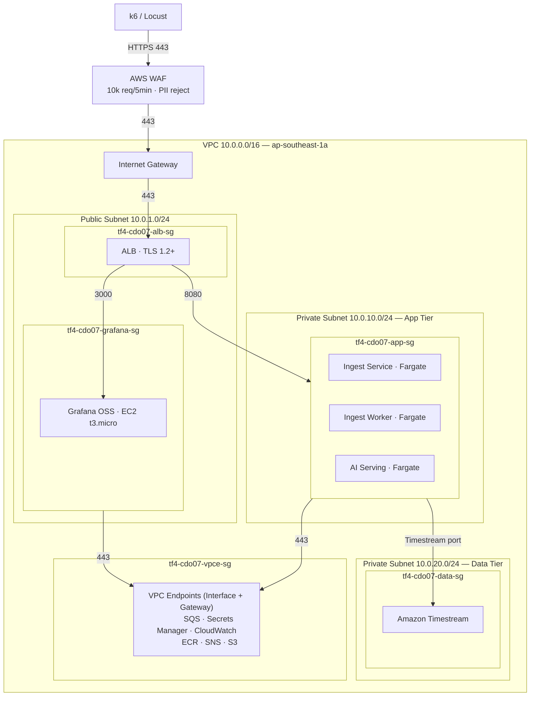

# Security Design - Task Force 4 · CDO-07

<!-- Doc owner: CDO-07
     Status: Draft (W11 T4) → Final (W11 T6 Pack #1) → Refined (W12 T4 Pack #2)
     Word target: 1200-2000 từ
     Last updated: 2026-06-22 -->

> **Scope**: DevOps-level security (network, IAM, secrets, encryption, audit).
> Không phải security audit enterprise. Focus vào những gì CDO-07 thực sự cấu hình + deploy.
>
> **W11 T6 minimum**: §1 + §2 + §3 + §4 + §5 (skeleton) + §7 (open questions)
> **W12 T4 final**: tất cả section refined với evidence (IAM policy snippets, KMS ARN, audit log sample)

---

## 1. Network Security

### 1.1 Network Security Diagram

<!-- Focus: security boundaries (SG zones), allowed ports, VPC Endpoint isolation.
     Architecture data-flow → xem 02_infra_design.md §1. -->



### 1.2 Security Groups

| SG name | Inbound | Outbound | Attached to |
|---|---|---|---|
| `tf4-cdo07-alb-sg` | 443 (HTTPS) từ AWS WAF qua IGW | 8080 → `tf4-cdo07-app-sg` | Application Load Balancer |
| `tf4-cdo07-app-sg` | 8080 từ `tf4-cdo07-alb-sg` only | 443 → VPC Endpoints (SQS, Secrets Manager, CloudWatch, ECR); Timestream port → `tf4-cdo07-data-sg` | Ingest Service, Ingest Worker, AI Serving (ECS Fargate) |
| `tf4-cdo07-data-sg` | Timestream port từ `tf4-cdo07-app-sg` only | (none — stateful response only) | Amazon Timestream |
| `tf4-cdo07-grafana-sg` | 3000 từ `tf4-cdo07-alb-sg` (Grafana UI) | 443 → CloudWatch VPC Endpoint | Grafana OSS (EC2 t3.micro) |
| `tf4-cdo07-vpce-sg` | 443 từ `tf4-cdo07-app-sg`, `tf4-cdo07-grafana-sg` | (none) | Tất cả Interface VPC Endpoints |

> **Nguyên tắc**: Mọi SG đều dùng **source SG reference** thay vì CIDR trực tiếp để đảm bảo implicit deny khi service bị detach.

### 1.3 VPC Endpoints (private traffic, không ra Internet)

| Service | Endpoint type | Purpose |
|---|---|---|
| SQS | Interface | Ingest Service enqueue / Ingest Worker poll — không qua NAT |
| Secrets Manager | Interface | AI Serving + Ingest Worker lấy secret tại runtime |
| CloudWatch Logs | Interface | Đẩy application log từ App Tier — không qua NAT |
| CloudWatch Monitoring | Interface | Grafana OSS query metric — không qua NAT |
| ECR (API + Docker) | Interface | Pull container image cho ECS tasks — không qua NAT |
| S3 | Gateway | Audit log write (SSE-KMS), Baseline Models read, Terraform state |
| SNS | Interface | AI Serving gửi alert notification — không qua NAT |

> **Lưu ý**: Không triển khai NAT Gateway — toàn bộ outbound traffic AWS service đi qua VPC Endpoints. Tiết kiệm chi phí NAT (~$32/tháng) phù hợp budget cap $200/tháng.

### 1.4 AWS WAF (Edge Protection)

| Rule | Mô tả | Action |
|---|---|---|
| Rate-limit | ≤ 10,000 req/5min per IP | Block + CloudWatch metric |
| PII regex reject | Reject payload chứa PII pattern (email, phone, card_number) | Block |
| Schema whitelist | Chỉ accept payload fields đã defined trong Telemetry Contract | Block |
| SQL injection / XSS | AWS Managed Rules `AWSManagedRulesCommonRuleSet` | Block |

---

## 2. IAM & Access Control

### 2.1 Service Roles (least-privilege)

| Role | Used by | Key permissions | KHÔNG có |
|---|---|---|---|
| `tf4-cdo07-ai-serving-task-role` | AI Serving (ECS Fargate) | `timestream:Select` (read query 2h window), `timestream:DescribeEndpoints`, `s3:PutObject` (audit bucket `tf4-cdo07-audit-log`), `s3:GetObject` (baseline bucket `tf4-cdo07-baseline-models`), `secretsmanager:GetSecretValue` (ARN `tf4/cdo07/*`), `sns:Publish` (alert topic ARN), `cloudwatch:PutMetricData`, `logs:PutLogEvents`, `kms:GenerateDataKey`, `kms:Decrypt` (CMK ARN) | `iam:*`, `s3:Delete*`, `ec2:*`, `timestream:WriteRecords` |
| `tf4-cdo07-ingest-svc-task-role` | Ingest Service (ECS Fargate) | `sqs:SendMessage` (ingest queue ARN), `cloudwatch:PutMetricData`, `logs:PutLogEvents`, `kms:GenerateDataKey` (encrypt SQS message) | `timestream:*`, `s3:*`, `iam:*` |
| `tf4-cdo07-ingest-worker-task-role` | Ingest Worker (ECS Fargate) | `sqs:ReceiveMessage`, `sqs:DeleteMessage` (ingest queue ARN), `timestream:WriteRecords` (BatchWrite), `timestream:DescribeEndpoints`, `cloudwatch:PutMetricData`, `logs:PutLogEvents`, `kms:Decrypt` (decrypt SQS message) | `sqs:CreateQueue`, `iam:*`, `s3:*` |
| `tf4-cdo07-grafana-ec2-role` | Grafana OSS (EC2 t3.micro) | `cloudwatch:GetMetricData`, `cloudwatch:ListMetrics`, `cloudwatch:GetDashboard`, `timestream:Select` (read-only), `timestream:DescribeEndpoints`, `logs:GetLogEvents` | Mọi write/mutate action, `iam:*` |
| `tf4-cdo07-eventbridge-invoke-role` | EventBridge (trigger `rate(5 minutes)`) | `ecs:RunTask` (scoped ARN cho AI Serving task) | `iam:*`, `s3:*`, `ec2:*` |
| `tf4-cdo07-platform-deploy-role` | GitHub Actions CI/CD (OIDC) | `ecs:UpdateService`, `ecs:RegisterTaskDefinition`, `ecr:PutImage`, `ecr:GetAuthorizationToken`, `s3:PutObject` (tf-state bucket), `cloudformation:*` (scoped `tf4-cdo07-*` stack) | `iam:CreateUser`, `iam:CreateRole` (ngoài boundary), `s3:Delete*` production |
| `tf4-cdo07-readonly-role` | Mentor review / debug access | `cloudwatch:GetMetricData`, `ecs:Describe*`, `timestream:Select`, `s3:GetObject` (audit bucket), `logs:GetLogEvents` | Mọi write/mutate action |

### 2.2 OIDC cho CI/CD (không dùng static AWS key)

```yaml
# GitHub Actions - assume role via OIDC, không hardcode AWS Access Key
- uses: aws-actions/configure-aws-credentials@v4
  with:
    role-to-assume: arn:aws:iam::<ACCOUNT>:role/tf4-cdo07-platform-deploy-role
    aws-region: ap-southeast-1
```

> **Tại sao OIDC?** Eliminates static credentials (AWS_ACCESS_KEY_ID / SECRET) khỏi GitHub Secrets. Token tự expire sau 1h, giảm blast radius nếu CI runner bị compromise.

### 2.3 Permission Boundary

- Boundary ARN: `arn:aws:iam::<ACCOUNT>:policy/tf4-cdo07-boundary`
- Enforces: không cho phép bất kỳ role nào tạo bởi `tf4-cdo07-platform-deploy-role` có quyền vượt ra ngoài `tf4-cdo07-*` resource scope
- Áp dụng: Attach vào tất cả IAM roles thuộc project CDO-07

```json
{
  "Version": "2012-10-17",
  "Statement": [
    {
      "Sid": "CDO07ResourceScope",
      "Effect": "Allow",
      "Action": "*",
      "Resource": [
        "arn:aws:*:ap-southeast-1:<ACCOUNT>:*tf4-cdo07*",
        "arn:aws:s3:::tf4-cdo07-*",
        "arn:aws:s3:::tf4-cdo07-*/*"
      ]
    },
    {
      "Sid": "DenyEscalation",
      "Effect": "Deny",
      "Action": [
        "iam:CreateUser",
        "iam:CreateAccessKey",
        "iam:AttachUserPolicy",
        "organizations:*"
      ],
      "Resource": "*"
    }
  ]
}
```

### 2.4 Resource Tagging Policy

Tất cả AWS resource phải có tag bắt buộc để phục vụ access control, cost allocation và audit:

| Tag Key | Value | Mục đích |
|---|---|---|
| `Project` | `foresight-lens` | Cost allocation, resource grouping |
| `Team` | `CDO-07` | Ownership identification |
| `Environment` | `capstone` | Environment classification |
| `ManagedBy` | `terraform` | Drift detection, compliance |

### 2.5 Cross-account Access

- **Không có cross-account access** trong phạm vi capstone. Toàn bộ resource nằm trong single AWS account.
- Nếu mở rộng production (multi-account): sử dụng `sts:AssumeRole` cross-account với external ID + condition key `aws:SourceAccount`. Document trong ADR khi cần.
- **K8s RBAC**: Không applicable — project dùng ECS Fargate, không dùng EKS.

---

## 3. Secrets Management

### 3.1 Secrets Inventory

| Secret | Path trong Secrets Manager | Rotation | Accessed by |
|---|---|---|---|
| Grafana API key (drift annotation) | `tf4/cdo07/grafana` | Manual (capstone) | `tf4-cdo07-ai-serving-task-role` |

**Không applicable trong project này:**

| Secret (template requirement) | Lý do không có |
|---|---|
| Bedrock / LLM API key | "LLM-based prediction – Không sử dụng do chi phí cao". Dùng statistical/ML-based forecasting |
| DB credentials (RDS) | Database là Timestream serverless — IAM auth, không cần credentials |
| Webhook signing key | Project dùng Amazon SNS cho alerting (push model), không expose webhook endpoint. Không có third-party callback cần verify signature |
| Slack webhook URL | Alerting qua SNS → email, không dùng Slack |

> **Phân loại config**: SQS Queue URL, SNS Topic ARN, Timestream endpoint là **infrastructure config** — inject qua **ECS Task Definition environment variable** hoặc **SSM Parameter Store**, không lưu trong Secrets Manager.

### 3.2 Inject Pattern

- **ECS Fargate (Ingest Worker, AI Serving, Ingest Service)**: secret reference trong task definition:
  ```json
  {
    "name": "GRAFANA_API_KEY",
    "valueFrom": "<GRAFANA_SECRET_ARN>"
  }
  ```
  → Inject thành environment variable tại runtime, **không bake vào Docker image**.
- **Infrastructure config (non-secret)**: inject trực tiếp qua ECS Task Definition environment:
  ```json
  [
    {"name": "SQS_QUEUE_URL", "value": "https://sqs.ap-southeast-1.amazonaws.com/<ACCOUNT>/tf4-cdo07-ingest-queue"},
    {"name": "SNS_TOPIC_ARN", "value": "arn:aws:sns:ap-southeast-1:<ACCOUNT>:tf4-cdo07-alerts"},
    {"name": "TIMESTREAM_DB", "value": "tf4-cdo07-metrics"},
    {"name": "S3_AUDIT_BUCKET", "value": "tf4-cdo07-audit-log"},
    {"name": "S3_BASELINE_BUCKET", "value": "tf4-cdo07-baseline-models"}
  ]
  ```

### 3.3 Anti-leak Controls

- **Gitleaks** scan trong CI pipeline — block merge nếu detect secret pattern (AWS key, private key, token)
- **Dockerfile review checklist**: không có `ENV SECRET=...`, `ARG PASSWORD=...` trong any Dockerfile
- **Application log redaction**: pattern matching tại application layer:
  - `Bearer\s+[A-Za-z0-9\-._~+/]+=*` → `[REDACTED]`
  - `AKIA[0-9A-Z]{16}` → `[AWS_KEY_REDACTED]`
  - `aws_secret_access_key\s*=\s*\S+` → `[REDACTED]`
- **ECR image scanning**: Enable Amazon ECR image scanning (Basic + Enhanced via Inspector) — block deployment nếu có CRITICAL/HIGH CVE
- **Pre-commit hook**: `.pre-commit-config.yaml` include `detect-secrets` để chặn secret trước khi commit

---

## 4. Encryption

### 4.1 At Rest
Toàn bộ dữ liệu lưu trữ tĩnh (Data at Rest) trong hệ thống phải được mã hóa nhằm ngăn chặn rủi ro truy cập vật lý trái phép hoặc rò rỉ dữ liệu giữa các phân vùng dùng chung tài khoản:
*   **Audit Log (AI decisions)**: Được lưu trữ tại Amazon S3 bucket `tf4-cdo07-audit-log` và bắt buộc mã hóa bằng Customer Managed Key (CMK) mã định danh `tf4-cdo07-audit-cmk`. Đồng thời, kích hoạt tính năng S3 Object Lock ở chế độ COMPLIANCE trong vòng 90 ngày để ngăn chặn mọi hành vi chỉnh sửa hoặc xóa bỏ từ mọi tác vụ.
*   **Time-series Metrics & Telemetry Data**: Lưu trữ tại Amazon Timestream và được mã hóa tĩnh mặc định ở cả Memory Store và Magnetic Store bằng AWS-managed key nhằm tối ưu chi phí và hiệu năng truy vấn cho dữ liệu tài chính.
*   **Hàng đợi tin nhắn (Queue Buffering)**: Amazon SQS Standard và DLQ sử dụng AWS-managed key để mã hóa dữ liệu tạm thời trong khi các thông điệp telemetry đang nằm chờ xử lý trên hàng đợi.
*   **Trạng thái hạ tầng (Terraform State)**: File state ứng dụng lưu tại S3 bucket `tf4-cdo07-tf-state` được mã hóa mặc định, kích hoạt bucket versioning và chính sách block public access toàn diện.
*   **Cấu hình bảo mật (Application Secrets)**: Toàn bộ thông tin nhạy cảm của hệ thống (như Grafana API key phục vụ đẩy annotation) được mã hóa tĩnh mặc định bên trong dịch vụ AWS Secrets Manager.

### 4.2 In Transit
Dữ liệu di chuyển qua mạng (Data in Transit) được bảo vệ bằng các giao thức mã hóa mạnh mẽ nhằm loại bỏ nguy cơ bị tấn công nghe lén (Man-in-the-middle):
*   **Điểm tiếp nhận bên ngoài (External Entry Point)**: Sử dụng Application Load Balancer (ALB) cấu hình lắng nghe giao thức HTTPS qua cổng 443. Hệ thống áp dụng chính sách bảo mật `ELBSecurityPolicy-TLS13-1-2-2021-06`, bắt buộc thực thi mã hóa TLS 1.2+ và khuyến nghị TLS 1.3.
*   **Giao tiếp nội bộ ứng dụng (Service-to-Service)**: Trong phạm vi Capstone hiện tại, giao tiếp giữa các thành phần dịch vụ dựa trên giao thức HTTPS và thực hiện xác thực quyền truy cập qua Bearer Token JWT. Giải pháp mã hóa mTLS (Mutual TLS) toàn vẹn giữa các container sẽ được thiết lập trong kế hoạch phát triển thuộc Phase 2.
*   **Cô lập kết nối dịch vụ AWS (AWS Service Traffic)**: Toàn bộ lưu lượng từ các tác vụ ECS Fargate (Ingest Service, Ingest Worker, AI Serving) kết nối tới SQS, Secrets Manager, CloudWatch, ECR và S3 đều đi qua hệ thống VPC Endpoints (Interface và Gateway). Luồng dữ liệu chạy hoàn toàn trong mạng nội bộ AWS, không đi qua Internet công cộng giúp loại bỏ hoàn toàn chi phí và rủi ro từ NAT Gateway.

### 4.3 Key Management
*   **Xoay vòng khóa (Key Rotation)**: Kích hoạt tính năng tự động xoay vòng khóa (Automatic Key Rotation) của Customer Managed Key (CMK) với chu kỳ cố định 1 năm một lần mà không làm thay đổi ARN của khóa hoặc làm gián đoạn ứng dụng.
*   **Chính sách sử dụng khóa (Key Policy)**: Thiết lập chính sách bảo mật đặc quyền tối thiểu trên khóa CMK, chỉ cấp quyền `kms:GenerateDataKey` và `kms:Decrypt` cho các IAM Task Role cụ thể cần thao tác (như `tf4-cdo07-ai-serving-task-role` và `tf4-cdo07-ingest-svc-task-role`). Quyền quản trị và cấu hình khóa (`kms:*`) bị từ chối đối với các tác vụ ứng dụng thông thường.
*   **Truy vết (Traceability)**: Kích hoạt AWS CloudTrail Data Events cho S3 Audit Bucket để ghi nhận nhật ký chi tiết của mọi hành động mã hóa hoặc giải mã dữ liệu kiểm toán hệ thống.

## 5. Audit Logging

### 5.1 What to Log
Hệ thống thực hiện ghi nhật ký kiểm toán (Audit Log) một cách có cấu trúc đối với tất cả các quyết định từ mô hình AI, các thay đổi hạ tầng và lỗi ứng dụng:
*   **AI Prediction Calls (`/v1/predict`)**: Mọi lượt gọi xử lý dự đoán trôi lệch dữ liệu của tác vụ AI Serving đều được ghi lại dưới dạng cấu trúc JSON chứa tối thiểu 6 trường thông tin cốt lõi phục vụ công tác đối soát:
```json
    {
      "timestamp": "2026-06-24T14:31:16Z",
      "tenant_id": "payment-gateway-prod",
      "service_id": "payment-gateway",
      "correlation_id": "cdo07-f83b-4c4e-92a1-8394bc410d9e",
      "input_hash": "sha256:e3b0c44298fc1c149afbf4c8996fb92427ae41e4649b934ca495991b7852b855",
      "prediction_result": "drift_detected",
      "confidence": 0.89,
      "model_version": "v1.2.0",
      "latency_ms": 145
    }
```
*   **Thay đổi hạ tầng (Infrastructure Change)**: Toàn bộ nhật ký thay đổi tài nguyên ứng dụng (như thao tác chạy `terraform apply`, cập nhật số lượng tác vụ ECS service hoặc đăng ký phiên bản Task Definition mới) được giám sát tự động qua AWS CloudTrail Management Events.
*   **Lỗi ứng dụng (Application Error)**: Các log lỗi runtime, lỗi ghi chép cơ sở dữ liệu hoặc hành vi kích hoạt Circuit Breaker được ghi nhận dưới dạng Structured JSON và có gắn kèm `correlation_id` cụ thể nhằm hỗ trợ việc vết lỗi liên dịch vụ nhanh chóng.

### 5.2 Storage + Retention
Các loại nhật ký hệ thống được phân loại lưu trữ và áp dụng chính sách duy trì nghiêm ngặt để cân bằng giữa tính tuân thủ và chi phí vận hành:
*   **AI Decision Audit Log**: Lưu trữ trực tiếp tại S3 Audit Bucket có cấu hình Object Lock chống xóa. Thời gian lưu trữ tối thiểu là 90 ngày ở phân vùng lưu trữ Hot và tự động chuyển đổi sang S3 Glacier lưu giữ trong vòng 1 năm nhờ cơ chế S3 Lifecycle. Việc truy vấn, đối soát dữ liệu được thực hiện trực tiếp thông qua giao diện **Amazon Athena** bằng câu lệnh SQL chuẩn.
*   **CloudTrail Logs**: Lưu trữ tại S3 bucket chuyên dụng kết hợp CloudTrail Lake với thời gian duy trì nhật ký cấu hình là 90 ngày.
*   **Application Runtime & Ingest Logs**: Lưu trữ trực tiếp tại Amazon CloudWatch Logs nhằm phục vụ gỡ lỗi trực tiếp. Thời gian duy trì lần lượt là 14 ngày đối với log ứng dụng thông thường và 7 ngày đối với log hoạt động của luồng ingest data. Người dùng có thể truy vấn nhanh qua công cụ **CloudWatch Logs Insights**.

### 5.3 PII Handling
Để đảm bảo an toàn tuyệt đối cho dữ liệu giao dịch tài chính trong bối cảnh Fintech, hệ thống áp dụng cơ chế bảo vệ và lọc bỏ thông tin định danh cá nhân (PII) chủ động:
*   **Lọc payload tại biên mạng**: Hệ thống AWS WAF thực hiện kiểm tra sâu Layer 7 payload nhằm phát hiện sớm và chặn đứng (Block) các yêu cầu chứa mẫu ký tự nhạy cảm có định dạng giống `email`, `phone_number`, hoặc thông tin số thẻ tín dụng (`card_number`) trước khi dữ liệu đi vào mạng VPC.
*   **Áp dụng Whitelist Schema**: Thành phần Ingest Service áp dụng chính sách kiểm tra dữ liệu nghiêm ngặt dựa theo cấu trúc trường dữ liệu đã được định nghĩa và cho phép (Whitelist) trong Telemetry Contract. Mọi yêu cầu chứa trường lạ nằm ngoài Whitelist sẽ bị từ chối xử lý tức thì để tránh lọt PII ẩn.
*   **Che giấu dữ liệu tầng ứng dụng (Redaction)**: Tầng ứng dụng tại Ingest Worker sử dụng logic so khớp mẫu (Pattern Matching) để tìm kiếm và chuyển đổi các thông tin nhạy cảm vô tình lọt qua tầng biên thành dạng chuỗi che khuất (Ví dụ: Các từ khóa nhạy cảm, chuỗi token bảo mật lọt vào log sẽ đổi thành định dạng `[REDACTED]`).
*   **Kiểm thử tuân thủ tự động**: Triển khai bộ unit test riêng biệt thông qua tệp tin `tests/test_pii_redaction.py` chạy trong CI pipeline. Việc này giúp liên tục xác minh tính chính xác của bộ lọc dữ liệu PII trước khi đưa mã nguồn lên môi trường staging hoặc production.

## 6. Compliance Touchpoints

Hệ thống ánh xạ trực tiếp các giải pháp kỹ thuật và biện pháp kiểm soát an toàn thông tin thực tế được cấu hình trong dự án CDO-07 lên các điều khoản kiểm soát của các tiêu chuẩn bảo mật quốc tế để phục vụ mục tiêu tuân thủ:

| Tiêu chuẩn (Standard) | Danh mục kiểm soát áp dụng ở cấp độ Control (Level Control) | Dịch vụ và Giải pháp kỹ thuật AWS áp dụng trong kiến trúc |
| :--- | :--- | :--- |
| **SOC2 Type II** | **CC6.1 (Logical Access Security)**: Hạn chế và cấp quyền truy cập tài nguyên logic dựa trên nguyên tắc đặc quyền tối thiểu. | * Áp dụng IAM Task Roles tối giản quyền, tách biệt hoàn toàn giữa vai trò đọc hàng đợi SQS và vai trò ghi Timestream.<br>* Sử dụng giải pháp xác thực OIDC kết nối GitHub Actions để cấp quyền truy cập ngắn hạn, loại bỏ hoàn toàn việc lưu trữ tĩnh các khóa AWS Access Key trên môi trường quản lý mã nguồn. |
| | **CC7.2 (System Monitoring)**: Giám sát toàn diện hạ tầng kỹ thuật nhằm kịp thời phát hiện các lỗ hổng cấu hình hoặc hành vi bất thường. | * Cấu hình hệ thống CloudWatch Alarms theo dõi sát sao chỉ số Kinesis Iterator Age, lỗi Timestream write và trạng thái hoạt động của Circuit Breaker để tránh lỗi silent fail.<br>* Tích hợp công cụ Amazon Managed Grafana hiển thị trực quan các điểm cảnh báo lệch pha dữ liệu (Drift Annotations Overlay). |
| | **CC8.1 (Change Management)**: Đảm bảo mọi thay đổi đối với môi trường hoạt động đều được định nghĩa, kiểm tra và phê duyệt rõ ràng. | * Triển khai cơ chế GitOps đồng bộ thông qua Terraform IaC với pipeline tự động chạy `terraform plan`, `tflint` và Checkov để quét lỗi bảo mật hạ tầng tại mọi pull request mở.<br>* Ràng buộc quy trình Branch Protection và quy định cần tối thiểu 1 Tech Lead approval trước khi trộn mã nguồn vào nhánh ổn định. |
| **GDPR** | **Article 32 (Security of Processing)**: Đảm bảo mức độ an toàn thông tin phù hợp với rủi ro thông qua mã hóa dữ liệu. | * Thực hiện mã hóa tĩnh (At Rest) thông qua KMS CMK riêng biệt và mã hóa động trên đường truyền (In Transit) sử dụng giao thức bảo mật TLS 1.2+.<br>* Cô lập toàn bộ lưu lượng kết nối nội bộ giữa các container và dịch vụ của AWS qua mạng riêng nhờ hệ thống VPC Endpoints. |
| **PCI-DSS** | **Requirement 3 (Protect Stored Cardholder Data)**: Bảo vệ dữ liệu thẻ thanh toán lưu trữ trong hệ thống ứng dụng. | * Chặn đứng và triệt tiêu nguy cơ lưu trữ thông tin thẻ nhạy cảm thông qua bộ lọc sâu AWS WAF Layer 7 payload inspection phối hợp cùng logic lọc dữ liệu PII chủ động tại tầng ứng dụng. |
| | **Requirement 10 (Track and Monitor All Access)**: Theo dõi và ghi nhận đầy đủ nhật ký kiểm toán đối với toàn bộ các truy cập mạng và dữ liệu hệ thống. | * Thiết lập giải pháp lưu trữ tập trung dữ liệu Audit Log quyết định AI trên hạ tầng Amazon S3 có kích hoạt S3 Object Lock ở chế độ Compliance trong vòng 90 ngày nhằm chống lại mọi hành vi thay đổi hoặc xóa bỏ nhật ký chuỗi kiểm toán. |

## 7. Open Questions

Dưới đây là các câu hỏi mở cần được thảo luận, thống nhất thêm sau các phiên làm việc chung với đội ngũ AI và đại diện phía khách hàng để hoàn thiện thiết kế an toàn thông tin cho hệ thống:
*   [ ] **Q1 (Account Structure)**: Khách hàng yêu cầu triển khai môi trường Production trên một AWS Account độc lập hoàn toàn về mặt vật lý, hay chấp nhận mô hình chia sẻ tài khoản (Shared AWS Account) sử dụng chính sách giới hạn phạm vi tài nguyên `tf4-cdo07-*` thông qua IAM Permission Boundary?
*   [ ] **Q2 (Audit Log Format & Integrity)**: Để phục vụ mục tiêu chống chối bỏ hoàn toàn đối với các quyết định từ mô hình AI, định dạng JSON lưu trên S3 hiện tại đã đủ đáp ứng yêu cầu pháp lý của doanh nghiệp chưa, hay hệ thống cần bổ sung thêm giải pháp ký số (Digital Signature) hoặc chuỗi mã băm (Hash Chain) cho từng tệp tin log trước khi lưu trữ?
*   [ ] **Q3 (Onboarding & Failure Destination Ownership)**: S3 bucket cấu hình cho phân vùng nhận dữ liệu lỗi hoặc dữ liệu sai lệch cấu trúc schema (theo cam kết tại Telemetry Contract) sẽ do đội ngũ Hạ tầng CDO quản lý tập trung hay bàn giao quyền sở hữu hoàn toàn cho đội ngũ AI vận hành và xử lý dữ liệu lỗi?
*   [ ] **Q4 (Alert Channel Segregation)**: Đơn vị nào chịu trách nhiệm sở hữu và cấu hình trực tiếp các Webhook URL/SNS Topic cho việc nhận thông báo đẩy về tình trạng trôi lệch cấu trúc hạ tầng (Drift Detection) và lỗi ứng dụng nhằm tránh hiện tượng loãng cảnh báo (Alert Fatigue) trên các kênh vận hành chung?
---

## Related documents

- [`02_infra_design.md`](02_infra_design.md) - Network topology source of truth
- [`04_deployment_design.md`](04_deployment_design.md) - CI/CD security gates (gitleaks, OIDC)
- [`08_adrs.md`](08_adrs.md) - ADR-004 (audit storage), ADR-005 (encryption strategy)
